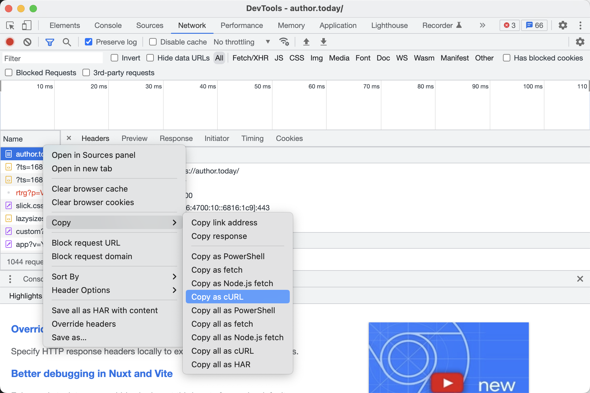

#NB! for a personal purpose only

P.S. I really hate reading from a laptop or a phone. I want to read the
books from a epaper screen, this is only one reason of this application.

#NB! Please made a donation to book author before download it (this is only a way to have good books)

## Published web book to epub file converter

Allows you to download unfinished book and read it with a comfort.

* [curl_file_path] - path to the file in curl format
* [work_id] - book ID

## Authorisation

To authorize bot to website you need to copy to the text file first request after successful
auth on the website. Here is a screenshot:



then create a text file `curl.txt` and put content of the buffer there

After that you would be able to run 

```bash
./binary download ./curl.txt 279128
```
